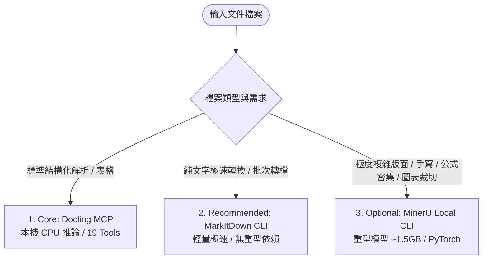

# Antigravity Dev Setup (antigravity-dev-setup)

本儲存庫為 **Google Antigravity AI Agent 開發環境的一鍵式 Windows 可攜式還原包**。
新電腦只需 Clone 本 Repo 並執行 `install.ps1`，即可精確還原具備程式碼分析、自動測試、瀏覽器除錯、靜態掃描與敏感文件本機解析能力的雙腦協作環境。

> [!NOTE]
> 本文件以目前實際運作環境（Actual Running Environment）為唯一 Source of Truth，杜絕規格漂移（Configuration Drift）。

---

### 可重現性分級架構 (Reproducibility Tiers)

本環境不浮誇宣稱整體系統「100% 完全可重現」，而是嚴格依元件本質進行四層分級管理：

1. **Pinned Local MCP & Plugins（可重現：Reproducible）**：
   - Serena MCP (`701e7c8`)、Playwright MCP (`0.0.80`)、Chrome DevTools MCP (`1.9.0`)、Docling MCP (`3.2.0`)、Semgrep (`1.177.0`) 以及 Superpowers Plugin (`b36e082`)。
   - 所有本機 MCP 與外掛一律鎖定驗證通過之特定版本或 Git Commit，**嚴禁在生產設定中使用 `@latest` 或浮動分支**，確保跨電腦安裝具備確定的工具數量與參數結構。
2. **Base Runtimes（已驗證相容版本：Verified Compatible Versions）**：
   - Git (`2.55.0`)、Node.js LTS (`v24.14.1`)、Astral uv (`0.12.13`)。
   - 透過系統套件管理員（winget / 官方安裝程式）安裝於 CurrentUser 範圍之基礎執行期。
3. **Remote MCPs（外部依賴：External Dependency）**：
   - Context7 MCP (`https://mcp.context7.com/mcp`) 與 GitHub Copilot MCP (`https://api.githubcopilot.com/mcp/`)。
   - 屬於外部雲端託管服務（Externally Managed Remote Services），其即時端點響應與上游更新由服務商維護，不納入版本固定之承諾範圍。
4. **Credentials（個人特異設定：User-Specific）**：
   - GitHub PAT 為個人授權憑證。未提供 PAT 時 GitHub MCP 安裝仍會成功，但處於 `Needs Authentication` 狀態，需由使用者按需提供。
5. **資料隱私邊界（敏感文件解析 Local-only）**：
   - 機密文件、網路日誌、內部 IP 等敏感資料解析，強制鎖定於本地引擎（Docling MCP / MinerU Local），絕不上傳至任何第三方雲端文件 API。

---

## 包含元件與實機驗證版本 (Verified Versions)

本環境核心套件於 Windows 11 實機環境完成端到端整合測試：

| 元件名稱 | 分級類型 | 驗證版本 | 精確安裝 / 來源指令 | 職責與能力說明 |
| :--- | :---: | :---: | :--- | :--- |
| **Git** | Base Runtime | `2.55.0` | `winget install Git.Git` | 版本控制與外掛儲存庫同步 |
| **Node.js** | Base Runtime | `v24.14.1` | `winget install OpenJS.NodeJS.LTS` | 執行 JavaScript/TypeScript MCP 伺服器 |
| **npm / npx** | Base Runtime | `11.11.0` | 隨 Node.js LTS 內建 | Node.js 套件生態與執行工具 |
| **uv / uvx** | Base Runtime | `0.12.13` | `irm https://astral.sh/uv/install.ps1 \| iex` | 極速 Python 虛擬環境與 Tool 隔離執行 |
| **Semgrep** | Pinned Local | `1.177.0` | `uv tool install semgrep==1.177.0` | 程式碼變更後靜態安全與規則掃描（7 tools） |
| **Serena MCP** | Pinned Local | `701e7c8` (`v1.7.0`) | `uvx --from git+https://github.com/oraios/serena@701e7c843f46c6a649203a488cece1bf19f1df90 serena start-mcp-server --context=antigravity` | AST 語義級 Symbol 導航與代碼關聯查找（24 tools） |
| **Context7 MCP** | Remote Service | `Cloud API` | `https://mcp.context7.com/mcp` (Remote) | 第三方套件官方版本敏感文件即時檢索（2 tools） |
| **Playwright MCP**| Pinned Local | `0.0.80` | `npx -y @playwright/mcp@0.0.80` | Web UI 行為驗證、DOM 快照與測試（24 tools） |
| **GitHub MCP** | Remote Service | `Copilot API`| `https://api.githubcopilot.com/mcp/` (Remote) | 遠端倉庫、PR、Issue 查詢與協作審查（41 tools，需 PAT） |
| **Chrome DevTools**| Pinned Local | `1.9.0` | `npx -y chrome-devtools-mcp@1.9.0 --headless` | CDP 協議層 Console、Network 與效能除錯（58 tools） |
| **Docling MCP** | Pinned Local | `3.2.0` | `uvx --from "docling-mcp[local]==3.2.0" docling-mcp-server --transport stdio` | **敏感文件解析 Local-only**：本機結構化多格式文件解析（19 tools） |
| **Superpowers** | Pinned Local | `v6.3.0` | `git clone https://github.com/obra/superpowers.git` (Commit: `b36e082`) | 官方 TDD、規格規劃、除錯與審查工作流 |
| **MarkItDown** | Recommended CLI| `0.1.7` | `uv tool install "markitdown[all]==0.1.7"` | 輕量極速 Office / 文本轉 Markdown CLI |
| **MinerU Local** | Optional CLI | `3.4.5` | `uv tool install "mineru[pipeline]==3.4.5" --with "transformers==4.57.6" --with six` | **敏感文件解析 Local-only**：深度版面分析、複雜公式與圖表裁切 |

> [!IMPORTANT]
> **MCP Tools 總數統計**：目前實際運作之 7 大 MCP Server 總計提供 **175 個 Tools**（Serena: 24、Context7: 2、Playwright: 24、GitHub: 41、Chrome DevTools: 58、Semgrep: 7、Docling: 19）。

---

## 專案結構

```text
antigravity-dev-setup/
├── CHANGELOG.md                    # 版本歷程與變更清單
├── README.md                       # 本說明文件 (Single Source of Truth)
├── install.ps1                     # 一鍵安裝入口 (支援 -DryRun, -InstallMarkItDown, -InstallMinerU)
├── verify.ps1                      # 11 項環境健康、BOM 與 MCP 註冊驗證工具
├── config/
│   ├── GEMINI.md                   # 全域規範與工具協作守則
│   └── mcp_config.template.json    # 7 大 MCP 精確版本設定範本 (無硬編碼金鑰，無 @latest)
├── scripts/
│   ├── backup-existing-config.ps1  # 備份既有 ~/.gemini/config/
│   ├── install-prerequisites.ps1   # 檢查並安裝 Git, Node, uv, Semgrep==1.177.0 (CurrentUser)
│   └── install-mcp.ps1             # 安全 JSON Merge (無 BOM)、Superpowers 與外掛安裝
├── docs/
│   ├── ARCHITECTURE.md             # 架構圖與路徑規範
│   └── TOOL-WORKFLOW.md            # 工具調用準則與決策樹
└── .gitignore                      # 徹底過濾本地機密與暫存檔
```

---

## 文件處理工具分級與能力矩陣 (Document Intelligence Tiering)

為兼顧解析品質、安全性與本機資源負擔，文件處理工具分為三級，其安裝邏輯與適用場景如下：



### 1. Core (預設必備)：Docling MCP (`3.2.0`)
- **安裝邏輯**：預設包含於核心 `mcp_config.json`，無需額外安裝 CLI。
- **執行特性**：環境變數強制設定 `DOCLING_MCP_CONVERSION_MODE=local`，在本地 CPU 執行推論，**零外部網路傳輸**。
- **實際完整支援格式**：
  - **文件與排版**：PDF、DOCX、DOC、PPTX、PPT、ODT、ODS、ODP
  - **表格與數據**：XLSX、XLS、CSV
  - **網路與純文字**：HTML、Markdown (`.md`)、AsciiDoc
  - **影像檔案**：PNG、JPEG、TIFF、BMP、WebP
  - **結構化資料**：XML (USPTO、JATS、XBRL、DocLang)、DCLX、METS_GBS

### 2. Recommended (推薦安裝)：MarkItDown CLI (`0.1.7`)
- **安裝邏輯**：獨立參數 `-InstallMarkItDown` 或互動選單安裝。
- **執行特性**：輕量無龐大模型依賴，極速提取文字與基本 Markdown。

### 3. Optional (選配安裝)：MinerU Local CLI (`3.4.5`)
- **安裝邏輯**：獨立參數 `-InstallMinerU` 或互動選單安裝。
- **執行特性**：依賴 PyTorch 與大型視覺模型權重（~1.5GB）。**僅在本地離線執行**，嚴禁使用任何 MinerU Cloud API。
- **相容性說明**：需鎖定 `transformers==4.57.6` 與 `six`。若執行相容性測試未通過，請參閱說明手動排查，安裝腳本不靜默竄改第三方套件原始碼。

---

## 新電腦一鍵恢復流程

在全新安裝之 Windows 10 / 11 電腦上：

1. **取得 Repository**:
   ```powershell
   git clone <REPO_URL> antigravity-dev-setup
   cd antigravity-dev-setup
   ```

2. **執行安裝 (支援細粒度控制)**:
   ```powershell
   # 1. 預覽變更 (安全 Dry-Run)
   .\install.ps1 -DryRun

   # 2. 標準交互式安裝（預設安裝 7 大 Core MCPs、Superpowers 與基礎 CLI）
   #    若需配置 GitHub PAT，請依安全性提示輸入（終端自動遮罩）
   .\install.ps1

   # 3. 自動化非交互式安裝（推薦用於 CI 或自動化腳本）
   #    可事先在 Session 設定環境變數：$env:GITHUB_PAT = "your_pat"
   .\install.ps1 -NonInteractive

   # 4. 選配安裝推薦/選配文件工具
   .\install.ps1 -InstallMarkItDown                # 僅額外安裝 MarkItDown
   .\install.ps1 -InstallMarkItDown -InstallMinerU  # 包含重型 MinerU Local
   ```

3. **環境驗證**:
   ```powershell
   .\verify.ps1
   ```

4. **重啟 Antigravity**:
   重啟 Antigravity IDE 或 Agent Session，使全域規則與 MCP 設定生效。

---

## 企業電腦相容性與資訊安全原則

本專案安裝腳本嚴格依循企業資訊安全政策標準：
- **CurrentUser 範圍安裝**：所有 CLI 工具與設定檔均寫入 `$HOME` (`%USERPROFILE%`)，**不需要 Administrator 權限**。
- **不主動降低系統安全性**：
  - 不修改系統全域 `ExecutionPolicy`（僅在當前 Process Session 臨時 Bypass）。
  - 不關閉 Windows Defender 或任何端點防護軟體。
  - 不竄改系統 Proxy、DNS 或網路組態。
- **企業政策遇阻處置 SOP**：
  若公司端點政策阻擋未簽署腳本，請在終端機當前 Session 執行：
  ```powershell
  Set-ExecutionPolicy -Scope Process -ExecutionPolicy Bypass
  ```
- **敏感文件解析 Local-only 原則**：
  - 內部架構圖、內部 IP、日誌檔案、弱點掃描報告、客戶機密資料之文件解析，強制在本地離線執行（Docling / MinerU Local）。
  - 嚴禁串接任何第三方雲端文件解析 API（如 MinerU Cloud、Azure Document Intelligence 等）。
  - GitHub Copilot MCP 與 Context7 MCP 為遠端雲端端點，僅用於程式碼協作檢索與第三方套件公開文件查詢，不傳送本機機密文件內容。
- **零機密入庫與安全憑證處置**：
  - 移除所有命令列傳遞明文 PAT 之參數設計。
  - 支援 Process-level 臨時環境變數 `$env:GITHUB_PAT` 或互動式安全輸入（Masked input）。
  - PAT 永不出現在終端歷程（PSReadLine history）、README 範例、日誌或除錯輸出中。
  - GitHub PAT 僅儲存於本地之 `$HOME\.gemini\config\mcp_config.json`，已列入 `.gitignore`，嚴禁 Commit 進 Git。
- **GitHub PAT 權限配置指南（排查 403 錯誤）**：
  - **建議方案（Classic PAT）**：若需全自動建立遠端儲存庫與推送，推薦使用 Personal Access Token (Classic) 並勾選 `repo` 權限。
  - **細粒度方案（Fine-grained PAT）**：若使用 Fine-grained PAT，Repository Access 必須設為 **"All repositories"**，且必須開啟：
    - `Administration`: Read and Write（若未開啟此項，透過 API/MCP 自動建庫將報 `403 Resource not accessible by personal access token`）
    - `Contents`: Read and Write
    - `Pull requests`: Read and Write
    - `Issues`: Read and Write
  - **手動建庫（最小權限原則，無需 Administration）**：若不願賦予 PAT 過高之管理權限，可於 GitHub 網頁手動建立同名空白 Repository，此時僅需標準 `Contents: Read and Write` 即可直接 `git push`。
- **無寫死個人路徑**：
  全數使用動態路徑變數（`$env:USERPROFILE`），確保在不同使用者名稱之電腦上無縫運行。
